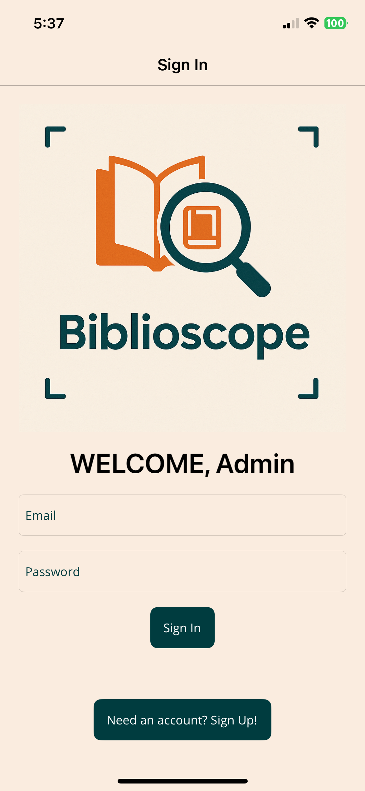

# BiblioScope
<table>
  <tr>
    <td>
      
    </td>
    <td style="vertical-align: middle; padding-left: 20px;">
      <strong>BiblioScope</strong> is a cross-platform mobile app that empowers users to <strong>scan, search, organize, and track</strong> their personal library collections.  
      It combines real-time OCR (Optical Character Recognition), book discovery, and reading progress tracking with cloud sync and intuitive UX — built using modern mobile development patterns and cloud technologies.
    </td>
  </tr>
</table>

<p align="center">
  
  
</p>

## Features

- 📷 **Book Scanning with OCR**: Take or upload photos of book covers to extract titles using **Azure Computer Vision**.

- 🔍 **Search by Title**: Search and discover books using the **Hardcover GraphQL API**.

- 📖 **Smart Library Management**: Add, view, filter, and remove books from your personal cloud library.

- 🔐 **User Authentication**: Sign in/sign out using **Firebase Authentication** (email/password).

- ☁️ **Persistent Cloud Sync**: User-specific book data and profile pictures stored via **Firebase Firestore** and **Firebase Storage**.

- 💡 **Personalized UX**: Profile page, genre filters, dynamic home page recommendations, and status badges.

---

## Tech Stack


| Layer    | Savings |
| -------- | ------- |
| **Frontend UI**   | [.NET MAUI](https://learn.microsoft.com/en-us/dotnet/maui/) (C# XAML)    |
| **Architecture** | MVVM (Model-View-ViewModel)      |
| **Cloud Functions**    | [Azure Computer Vision](https://azure.microsoft.com/en-us/products/cognitive-services/computer-vision/) for OCR   |
| **Backend Storage**   | [Firebase Firestore](https://firebase.google.com/docs/firestore) (NoSQL), [Firebase Storage](https://firebase.google.com/docs/storage)    |
| **Authentication**    | Firebase Authentication (email/password)   |
| **API Integration**    | [Hardcover.app GraphQL API](https://hardcover.app)    |
| **State Management**    | `ObservableCollection<T>`, CommunityToolkit MVVM    |


---

## Computer Science Concepts

| Area | Concept |
| ---| --- |
| **Software Engineering** | MVVM architecture, code separation, reusable UI components |
| **Mobile Computing** | Cross-platform app development (iOS + Android) |
| **Cloud Computing** | RESTful + GraphQL API calls, Firebase backend, Azure service integration |
| **Data Structures** | ObservableCollections, Dictionary mapping for GraphQL/Firestore serialization |
| **Concurrency** | Async/await patterns for HTTP calls, OCR processing, media access |
| **Security** | Token-based Firebase authentication |
| **UX Design** | Gesture recognizers, dynamic image handling, genre filter chips, responsive layouts |

---

## Mobile Architecture Overview

```plaintxt
UserLibraryPage.xaml      <- View (XAML UI)

LibraryViewModel.cs       <- ViewModel (business logic, data bindings)

UserLibrary.cs            <- Model (singleton data store for user's books)

FirestoreService.cs       <- Service (cloud sync operations)

ScanBookPage              <- View with camera/OCR flow

PossibleMatchesPage       <- View that presents matched search results

BookDetailPage            <- Detail view with "Add to Library" logic
```

# Setup Instructions

## Clone the repo

```bash
git clone https://github.com/adolfo-david-romero/BiblioScope.git
```

Open in Visual Studio 2022+/Jetbrains Rider with .NET MAUI workload installed

Add your Azure Computer Vision and Firebase config in environment config

# 👨‍💻 Developed By

**David Romero: Computer Science -- Mobile Computing, Sheridan College**

## This project was created as a project to demonstrate full-stack mobile development, cloud service integration, and practical application of computer science concepts in a modern app.
